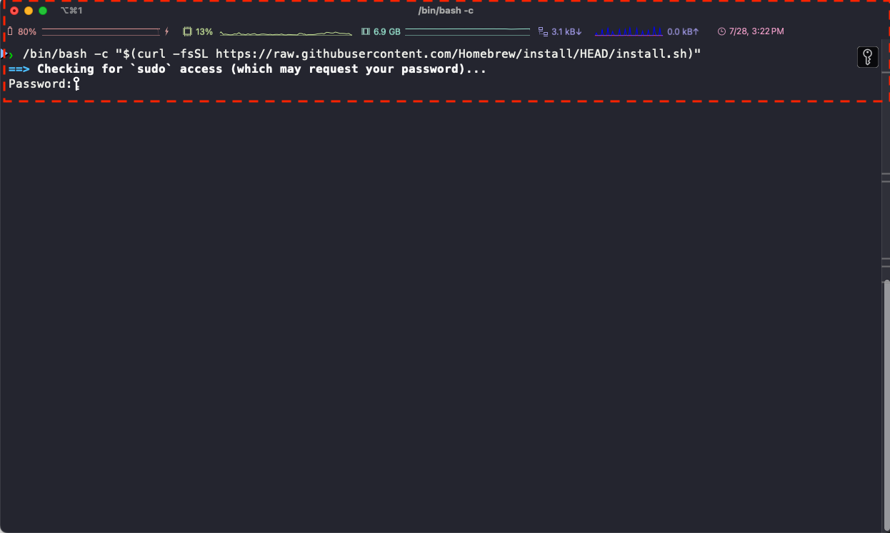

# 환경 설정 (Mac)

## 터미널 열기

	•	Spotlight(⌘ + Space) → “Terminal” 검색 후 실행

## Homebrew 설치

### Homebrew 설치 명령어

#### 1. 아래의 명령어를 실행하여 Homebrew 설치

```bash
/bin/bash -c "$(curl -fsSL https://raw.githubusercontent.com/Homebrew/install/HEAD/install.sh)"
```

계정의 **비밀번호** 입력



**ENTER** 키를 눌러서 진행

#### 2. 아래의 명령어를 실행(<홈> 은 본인의 계정명으로 바꾸세요!!)

다음의 명령어를 실행하여 계정의 username 을 확인합니다.

brew의 위치를 확인합니다.

```bash
which brew
```

brew 가 설치된 경로를 확인합니다.

- Case 1

```bash
/opt/homebrew/bin/brew shellenv
```

- Case 2

```bash
/usr/local/bin/brew shellenv
```

Case 1 인 경우 터미널의 환경변수에 brew 명령어 인식 하는 명령어
- eval "$(/opt/homebrew/bin/brew shellenv)"라는 문자열을 .zprofile 파일에 추가하라는 명령입니다.
- ~/.zprofile은 macOS 기본 셸인 zsh 셸의 로그인 초기화 파일로, 사용자가 터미널을 열 때 자동 실행됩니다.
- 즉, Homebrew의 환경변수 설정을 로그인할 때마다 자동 적용되도록 설정하는 것입니다.


```bash
echo 'eval "$(/opt/homebrew/bin/brew shellenv)"' >> $HOME/.zprofile
```

Case 2 인 경우
- eval "$(/usr/local/bin/brew shellenv)"라는 문자열을 .zprofile 파일에 추가하라는 명령입니다.
- ~/.zprofile은 macOS 기본 셸인 zsh 셸의 로그인 초기화 파일로, 사용자가 터미널을 열 때 자동 실행됩니다.
- 즉, Homebrew의 환경변수 설정을 로그인할 때마다 자동 적용되도록 설정하는 것입니다.
```bash
echo 'eval "$(/usr/local/bin/brew shellenv)"' >> $HOME/.zprofile
```

## xcode 설치 확인
Homebrew는 많은 패키지를 소스 코드에서 직접 컴파일하거나 빌드하기 때문에, 내부적으로 clang, make, git 등 도구를 호출합니다.
따라서 Command Line Tools가 없으면 설치 중 다음과 같은 오류가 발생합니다:
```bash
Error: The following tools are required to install Homebrew:
clang, git, make
```
또는 Homebrew 설치 중에 다음과 같은 메시지 뜨면:  설치 버튼 누르면 자동 설치 진행 됩니다.
```bash
The Xcode Command Line Tools will be installed.
```
수동 설치 방법
```bash
xcode-select --install
```

설치 여부 확인
```bash
xcode-select -p

#정상적으로 설치되었다면, 출력 결과는 다음과 비슷함
/Library/Developer/CommandLineTools
```


### git 설치 확인

터미널에 git 명령어를 입력하여 출력이 되면 아래의 설치를 진행할 필요 없음

#### (선택) git 설치가 안되어 있는 경우

```bash
brew install git
```

설치가 제대로 되어 있는지 다시 확인

```bash
git --version
```


## 실습코드 다운로드


- RAG 실습코드 링크: https://github.com/GyeongjinLee/RAG_Learning.git

Documents 로 이동하는 명령어 입력 (만약, `Documents` 폴더 외 다른곳에 다운로드 받고 싶다면 경로만 변경)

```bash
#내가 실습코드 다운로드 디렉토리 생성하여 진행 
cd Documents 
```

### git 명령어를 사용하여 실습코드 다운로드

`git` 명령어를 사용하여 실습코드 다운로드

```bash
git clone https://github.com/GyeongjinLee/RAG_Learning.git
```

## pyenv 설치

참고 링크: [https://github.com/pyenv/pyenv?tab=readme-ov-file#understanding-python-version-selection](https://github.com/pyenv/pyenv?tab=readme-ov-file#understanding-python-version-selection)

brew 를 통해 `pyenv` 를 업데이트 합니다.

```bash
brew update
brew install pyenv
brew install pipx
```

아래의 내용을 터미널에 복사 + 붙혀넣기 합니다.

```bash
echo 'export PYENV_ROOT="$HOME/.pyenv"' >> ~/.zshrc
echo '[[ -d $PYENV_ROOT/bin ]] && export PATH="$PYENV_ROOT/bin:$PATH"' >> ~/.zshrc
echo 'eval "$(pyenv init -)"' >> ~/.zshrc
```

(혹시 만약에 위의 코드 실행시 오류가 발생하는 경우만!!)

```bash
sudo chown $USER ~/.zshrc
echo 'export PYENV_ROOT="$HOME/.pyenv"' >> ~/.zshrc
echo '[[ -d $PYENV_ROOT/bin ]] && export PATH="$PYENV_ROOT/bin:$PATH"' >> ~/.zshrc
echo 'eval "$(pyenv init -)"' >> ~/.zshrc
```

터미널 쉘을 재시작 합니다.

```bash
exec "$SHELL"
```

## python 설치

파이썬 3.11 버전 설치

```bash
pyenv install 3.11.9
```

3.11 버전의 python 설정

```bash
pyenv global 3.11.9
exec zsh
```

파이썬 버전 확인

```bash
python --version
```

**3.11.9** 버전이 설치되어 있나 확인합니다.

## poetry 설치

참고 링크: [https://python-poetry.org/docs/#installing-with-the-official-installer](https://python-poetry.org/docs/#installing-with-the-official-installer)

poetry 설치

```bash
pipx install poetry==1.8.5
```

다운로드 받은 폴더로 이동

```bash
#작업 디렉토리 생성 및 이동
cd ~/Documents/RAG_lecture
```

파이썬 가상환경 설정
poetry 를 이용하여 파이썬 가상환경 및 패키지 관리를 위한 초기화
* 실습코드가 있는 디렉토리에서 실행
* 실행 완료 후  pyproject.toml 파일 생성됨
```bash
poetry init --name "RAG_Learning" --description "RAG 학습" --python "^3.11.9" --no-interaction
```
  
파이썬 패키지 일괄 업데이트

```bash
#requirments.txt 의 패키지 정보를 기반으로 설치 및 업데이트를 수행함
poetry add $(cat requirements.txt)
```

## Visual Studio Code 설치

Visual Studio Code 다운로드

- 다운로드 링크: [https://code.visualstudio.com/download](https://code.visualstudio.com/download)

## Visual Studio Code 설치

**VS Code는 마이크로소프트에서 개발한 무료 코드 편집기(코드 에디터)**입니다.  
다양한 프로그래밍 언어를 지원하고, 가볍지만 강력한 개발 도구입니다.
Visual Studio Code 다운로드

- 다운로드 링크: [https://code.visualstudio.com/download](https://code.visualstudio.com/download)

다운로드 받은 Visual Studio Code 를 설치합니다 (Applications 폴더에 복사)

Visual Studio Code 실행 후 왼쪽 install extensions 클릭
![[images/20250728001122.png]](images/20250728001122.png)

### python 검색 후 설치
* python 언어 개발 환경 지원하는 확장 팩
![[images/20250728001257.png]](images/20250728001257.png)
### jupyter 검색 후 설치
* **Jupyter는 코드, 수식, 시각화, 설명 문서를 한 화면에서 작성하고 실행할 수 있는 대화형 개발 환경**입니다.  특히 **데이터 분석, 머신러닝, 교육용 문서 작성** 등에 매우 널리 사용됩니다.
![[image/20250728001402.png]](images/20250728001402.png)


**Visual Studio Code 껐다가 재실행**

**설치가 다 되었으면, VS Code를 실행 상단 메뉴 File -> Open Folder 실습코드가 있는 디렉토리를 오픈**

- 우측 상단 "select kernel"

![[images/20250727183819.png]](images/20250727183819.png)
python environment 클릭 - 3.11.9 가상 환경 선택
- 설치한 가상환경이 안뜬다면 Visual Studio Code 껐다가 재실행
![[images/20250727190655.png]](images/20250727190655.png)